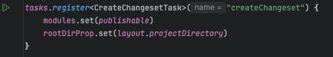
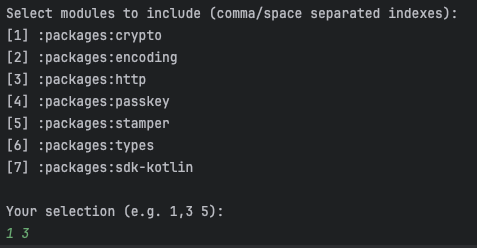
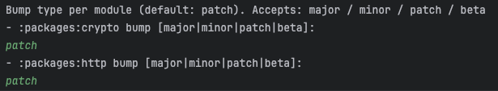
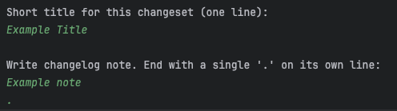

# Turnkey Kotlin SDK

[](LICENSE)
[]()
[](https://openjdk.org/projects/jdk/24/)
[](https://docs.turnkey.com/sdks/kotlin/overview)

> [!NOTE]
> **Beta Status:** This Kotlin SDK is in open beta while we refine the developer experience. You can use it today, but **minor releases may include breaking changes** until we reach v1.0.0. We recommend pinning exact versions and checking the changelog for each update.

The Turnkey **Kotlin/Android** SDKs provide everything you need to build a fully working Android app powered by Turnkey: typed HTTP access, auth flows (OAuth / Passkeys / OTP), session + key management, and wallet utilities.

## Packages

| Package        | Description                                                                                                                                               | Path                                                      |
|----------------|-----------------------------------------------------------------------------------------------------------------------------------------------------------|-----------------------------------------------------------|
| **sdk-kotlin** | High‑level Android/Kotlin SDK: init/config, session lifecycle (persist/select/auto‑refresh), OAuth/Passkey/OTP helpers, wallet CRUD, and signing helpers. | [`packages/sdk-kotlin/`](./packages/sdk-kotlin/README.md) |
| **http**       | Lower‑level, fully typed HTTP client generated from OpenAPI (OkHttp + coroutines + kotlinx.serialization).                                                | [`packages/http/`](./packages/http/README.md)             |
| **crypto**     | P‑256 key utilities and Turnkey bundle (en/de)cryption helpers                                                                                            | [`packages/crypto/`](./packages/crypto/)                  |
| **encoding**   | Fast hex <> bytes, Base64url helpers, and secure random.                                                                                                  | [`packages/encoding/`](./packages/encoding/README.md)     |
| **passkey**    | Simple passkey registration/assertion wrappers over Credential Manager for Android.                                                                       | [`packages/passkey/`](./packages/passkey/README.md)       |
| **stamper**    | Produces HTTP request stamps from **API keys** or **passkeys** (header pair), consumed by `http` and usable standalone.                                   | [`packages/stamper/`](./packages/stamper/README.md)       |
| **types**      | Single‑file model set (`Models.kt`) for all Turnkey request/response types (public + auth‑proxy), generated from OpenAPI.                                 | [`packages/types/`](./packages/types/README.md)           |
| **tools**      | Internal codegen utilities used by `types` and `http` (generators, helpers).                                                                              | [`packages/tools/`](./packages/tools/README.md)           |

> See each package’s README for usage details and API docs.

## Quick start (Android)

**1) Add dependencies**:

```kotlin
// app/build.gradle.kts
dependencies {
  implementation("com.turnkey:sdk-kotlin:<version>")
  // (transitive) http, types, encoding, crypto, stamper, passkey
}
```

**2) Initialize** in your `Application` class:

```kotlin
class App : Application() {
  override fun onCreate() {
    super.onCreate()

    val createSubOrgParams = CreateSubOrgParams(
        customWallet = CustomWallet(
            walletName = "Wallet 1",
            walletAccounts = listOf(
                V1WalletAccountParams(
                    addressFormat = V1AddressFormat.ADDRESS_FORMAT_ETHEREUM,
                    curve = V1Curve.CURVE_SECP256K1,
                    path = "m/44'/60'/0'/0/0",
                    pathFormat = V1PathFormat.PATH_FORMAT_BIP32
                ),
                V1WalletAccountParams(
                    addressFormat = V1AddressFormat.ADDRESS_FORMAT_SOLANA,
                    curve = V1Curve.CURVE_ED25519,
                    path = "m/44'/501'/0'/0'",
                    pathFormat = V1PathFormat.PATH_FORMAT_BIP32
                )
            )
        )
    )
      
    TurnkeyContext.init(
      this,
      TurnkeyConfig(
        apiBaseUrl = "https://api.turnkey.com",
        authProxyBaseUrl = "https://authproxy.turnkey.com",
        authProxyConfigId = "<your-auth-proxy-config-id>", 
        organizationId = "<your-organization-id>",
        appScheme = "<your-app-scheme>", // for OAuth deep link
        authConfig = AuthConfig(
          rpId = "<your-rp-id>",
          createSubOrgParams = MethodCreateSubOrgParams(
              emailOtpAuth = createSubOrgParams,
              smsOtpAuth = createSubOrgParams,
              passkeyAuth = createSubOrgParams,
              oAuth = createSubOrgParams
          ),
        )
      )
    )
  }
}
```

**3) Log in (examples)**

```kotlin
// OTP
val init = TurnkeyContext.initOtp(
    otpType = OtpType.OTP_TYPE_EMAIL,
    contact = "you@example.com"
)

val session = TurnkeyContext.loginOrSignUpWithOtp(
    otpId = init.otpId,
    otpCode = "123ABC",
    contact = "you@example.com",
    otpType = OtpType.OTP_TYPE_EMAIL
)

// Passkey
val passkey = TurnkeyContext.loginWithPasskey(activity = requireActivity())

// OAuth (Google)
TurnkeyContext.handleGoogleOAuth(activity = requireActivity())
```

**4) Use the client**

```kotlin
lifecycleScope.launch {
    val signature = TurnkeyContext.signMessage(
        signWith = "0x...address...",
        addressFormat = V1AddressFormat.ADDRESS_FORMAT_ETHEREUM,
        message = "Hello Turnkey!"
    )
    println("${signature.r}${signature.s}${signature.v}")
}
```

## Verify our artifacts!

At Turnkey, we take security very seriously. We sign every published artifact so you can verify that what you consume is exactly what we released.

### 1) Download the artifact + its detached signature:

>Replace ARTIFACT_ID with the module you’re verifying (e.g. sdk-kotlin, http, types) and VERSION with the version.

```bash
ARTIFACT_ID=sdk-kotlin
VERSION=<PACKAGE_VERSION>

# JAR and its .asc (detached signature)
curl -O https://repo1.maven.org/maven2/com/turnkey/${ARTIFACT_ID}/${VERSION}/${ARTIFACT_ID}-${VERSION}-sources.jar
curl -O https://repo1.maven.org/maven2/com/turnkey/${ARTIFACT_ID}/${VERSION}/${ARTIFACT_ID}-${VERSION}-sources.jar.asc

# (Recommended) also verify the POM:
curl -O https://repo1.maven.org/maven2/com/turnkey/${ARTIFACT_ID}/${VERSION}/${ARTIFACT_ID}-${VERSION}.pom
curl -O https://repo1.maven.org/maven2/com/turnkey/${ARTIFACT_ID}/${VERSION}/${ARTIFACT_ID}-${VERSION}.pom.asc
```

### 2) Import our public key (one-time)
- Our Kotlin publishing key is discoverable on [keys.openpgp.org](https://keys.openpgp.org/search?q=kotlin-publishers%40turnkey.io) under kotlin-publishers@turnkey.io

You can import by fingerprint:
```bash
# Replace the fingerprint with the one shown on keys.openpgp.org for kotlin-publishers@turnkey.io
gpg --keyserver hkps://keys.openpgp.org --recv-keys PUB_KEY_FINGERPRINT
```

You can confirm it’s in your keyring:
```bash
gpg --list-keys kotlin-publishers@turnkey.io
```

### 3) Verify signatures:
```bash
# Verify sources JAR
gpg --verify ${ARTIFACT_ID}-${VERSION}-sources.jar.asc ${ARTIFACT_ID}-${VERSION}-sources.jar

# Verify POM
gpg --verify ${ARTIFACT_ID}-${VERSION}.pom.asc ${ARTIFACT_ID}-${VERSION}.pom
```

If everything is good, you’ll see output like:
```bash
gpg: Signature made <SIGNATURE_TIMESTAMP>
gpg:                using RSA key <SIGNING_KEY_FINGERPRINT>
gpg: Good signature from "Turnkey Kotlin Publishers <kotlin-publishers@turnkey.io>"
```

### Troubleshooting

- **“No public key”**: Import the correct fingerprint (see step 2), or gpg --recv-keys <fingerprint> again.
- **Key trust level**: “Good signature” is what matters for authenticity. You can set ownertrust if you want, but it’s not required to validate the signature.
- **Wrong artifact path**: Double-check group ID (com.turnkey vs your snapshot/group), module (ARTIFACT_ID), and VERSION.

## Code generation

This repo uses a **tools** module to generate models and the typed HTTP client from Swagger.

| Artifact  | Task                                            | Inputs                                                                                             | Outputs                                                           |
|-----------|-------------------------------------------------|----------------------------------------------------------------------------------------------------|-------------------------------------------------------------------|
| **types** | `./gradlew :packages:types:regenerateModels`    | `packages/types/openapi/public_api.swagger.json`, `packages/types/openapi/auth_proxy.swagger.json` | `packages/types/src/main/kotlin/com/turnkey/types/Models.kt`      |
| **http**  | `./gradlew :packages:http:regenerateHttpClient` | `packages/http/openapi/public_api.swagger.json`, `packages/http/openapi/auth_proxy.swagger.json`   | `packages/http/src/main/kotlin/com/turnkey/http/TurnkeyClient.kt` |

> Exact task names/flags live in each module’s `build.gradle(.kts)` and are documented in the package READMEs.

## Repository layout

```
packages/
  encoding/
  crypto/
  passkey/
  stamper/
  types/
  http/
  sdk-kotlin/
  tools/
examples/
  kotlin-demo-wallet/
```

## Development

### Requirements

* **JDK/Toolchain:** Kotlin JVM toolchain 24 (see module `kotlin { jvmToolchain(24) }`)
* **Android:** compileSdk 36 (for Android modules), minSdk varies per package (e.g., passkey/stamper minSdk 28)

### Build & test

```bash
./gradlew build
./gradlew test
```

## Releasing

This repo uses the Vanniktech Maven Publish plugin.

1. Ensure changesets are present in the `/.changesets` directory (CI will check for present changesets and exit if none are present)
2. Push a release tag that follows the format: `v<year>.<month>.<release_no>` e.g: `v2025.11.1`
3. CI will automatically pick up the tag and kick off the publish flow
4. Await approval on the publish step and the rest is covered!

> CI usually publishes in dependency order. Only modules with version changes will be released. Use prerelease tags like `0.1.0‑beta.1` when needed.
> Bump precedence for versioning goes as follows: `beta` > `major` > `minor` > `patch` (meaning if a package has both a `major` and a `patch` changeset, the `major` bump will take precedence e.g. 0.1.0 (major + patch bump) -> 1.0.0)

> IMPORTANT: `beta` takes precedence over ALL, meaning if a package has a `major` changeset + a `beta` changeset, the final version will look like `0.1.0-beta.1` -> `0.1.0-beta.2 `

## Links

* Turnkey product docs: [https://docs.turnkey.com](https://docs.turnkey.com)
* Public API reference: [https://docs.turnkey.com/api](https://docs.turnkey.com/api)

## Security

* Private keys and mnemonics never leave the client; keep logging redacted.
* For passkeys, configure **Digital Asset Links** so your domain (RP ID) is associated with your app.
* For dev loopback, prefer `10.0.2.2` on Android emulators; allow cleartext only in debug builds.

## License

Apache-2.0

## Contributing

1. Open an issue or draft PR for discussion.
2. Keep changes small and well‑scoped.
3. Add tests for bugfixes and new features.
4. Add a changeset for your changes using the tooling found in the repo root `build.gradle.kts` ([here](./build.gradle.kts)). More information below.

## Changeset Tooling

This SDK uses a custom changeset tooling to handle changelogs & versioning.

### Adding a changeset

1) Go to the repo's root `build.gradle.kts` ([here](./build.gradle.kts)) and run the `createChangeset` task.

2) Choose which packages to write changesets for

3) Select the bump type per package (major, minor, patch, or beta)

4) Add a title and a note (end the note with a "." _on its own line_)


And that's it! Commit your changeset and the CI release tooling will cover the rest (changelogs + versioning)! If done properly, you should see your new changeset in the [.changeset](./.changeset) directory.

> IMPORTANT (again): `beta` takes precedence over ALL, meaning if a package has a `major` changeset + a `beta` changeset, the final version will look like `0.1.0-beta.1` -> `0.1.0-beta.2`

> This is purposeful since in our case, a beta version CAN INCLUDE breaking changes (unstable versions). If you are planning on releasing to production on a `beta` version, **please pin the version** so you don't receive breaking changes when bumping packages.